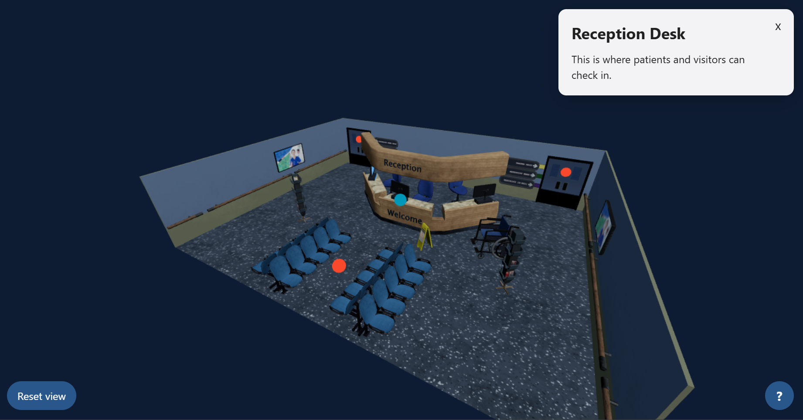

# Three.js Hospital Reception Demo

An interactive 3D hospital reception environment built with Three.js. The demo explores the foundations of browser-based spatial experiences, including glTF model loading, camera controls, raycasting, interactive hotspots, responsive UI, and mobile touch input.



## Live Demo

[Open the interactive demo](https://zezo2cool.github.io/threejs-hospital-reception-demo/)

## Overview

I created this project while learning Three.js for a graduate software role involving WebGL, 3D models, interactive hotspots, and spatial experiences.

Users can explore a hospital reception environment, select spatial markers, and view information about different areas of the hospital. The interface supports desktop and mobile controls.

## Features

- Hospital environment loaded from a glTF model
- Orbit, zoom, and pan controls
- Interactive 3D hotspots using raycasting
- Larger invisible hit targets for easier mobile interaction
- Hover and selected hotspot states
- HTML information panels connected to 3D objects
- Camera reset control
- Loading and error states
- Accessible help dialog with desktop and touch instructions
- Responsive desktop and mobile layout
- Directional and hemisphere lighting
- ACES filmic tone mapping
- Responsive camera and renderer resizing

## Controls

| Action           | Desktop               | Mobile                |
| ---------------- | --------------------- | --------------------- |
| Rotate view      | Left-drag             | Drag with one finger  |
| Zoom             | Mouse wheel           | Pinch                 |
| Pan              | Right-drag            | Drag with two fingers |
| Open hotspot     | Click a marker        | Tap a marker          |
| Restore overview | Select **Reset view** | Tap **Reset view**    |

## Technologies

- JavaScript
- Three.js
- WebGL
- Vite
- HTML
- CSS
- glTF/GLB assets

## Getting Started

### Prerequisites

Install a current Node.js version supported by Vite.

### Installation

```bash
git clone https://github.com/Zezo2cool/threejs-hospital-reception-demo.git
cd threejs-hospital-reception-demo
npm install
npm run dev
```

Open the local URL displayed by Vite.

### Production Build

```bash
npm run build
npm run preview
```

## Implementation Highlights

### Model loading and normalization

The hospital environment is loaded asynchronously with `GLTFLoader`. Because the downloaded model used large source coordinates, I measured it with `THREE.Box3`, scaled it to a predictable scene size, centred it horizontally, and placed its floor at `y = 0`.

### Camera controls

`OrbitControls` allows users to rotate, zoom, and pan around the environment. The renderer and perspective-camera projection update when the browser viewport changes.

### Interactive hotspots

Each hotspot contains a visible marker and a larger invisible raycasting target. Pointer coordinates are converted from browser coordinates into normalized device coordinates before `THREE.Raycaster` tests them against the hotspot targets.

Hotspot titles and descriptions are stored using Three.js `userData` and displayed in an HTML information panel when selected.

### Responsive interface

The WebGL canvas is combined with ordinary HTML overlays for loading, errors, help, camera controls, and hotspot information. The interface was tested with browser device emulation and on a physical mobile device.

## Project Structure

```text
├── public/
│   └── models/
│       └── hospital_reception_environment/
├── src/
│   ├── main.js
│   └── style.css
├── index.html
├── package.json
└── README.md
```

## What I Learned

Through this project, I developed a practical understanding of:

- The relationship between Three.js and WebGL
- Three.js scene graphs, cameras, renderers, lights, geometry, and materials
- Loading and transforming glTF assets
- Converting pointer coordinates for 3D raycasting
- Managing hover and selected interaction states
- Connecting WebGL content to accessible HTML interfaces
- Designing responsive 3D interactions for desktop and touch devices
- Testing and building a Three.js project with Vite

## Possible Future Improvements

- Smoothly focus the camera on a selected hotspot
- Add camera transitions between points of interest
- Add first-person or guided-tour navigation
- Compress and optimize model assets
- Add additional spatial annotations
- Explore environment lighting and realistic shadows
- Improve keyboard access to spatial markers

## 3D Model Attribution

This project uses [Hospital Reception Environment](https://sketchfab.com/3d-models/hospital-reception-environment-3d5b0ae00f9b4e2dad266fa0cd4748cb) by [CaseyPozzobon](https://sketchfab.com/CaseyPozzobon), licensed under [CC BY 4.0](https://creativecommons.org/licenses/by/4.0/).
